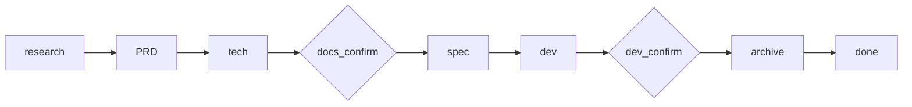

# spec-dev-skill

[](#)
[](#运行时兼容)
[](#workflow)
[](LICENSE)

`spec-dev` 是一个兼容 Codex 和 Claude Code 的需求开发全流程 Skill。它把一段需求描述推进为调研结论、PRD、技术方案、任务清单、代码实现确认和归档记录，适合 Java 后端微服务，也可以用于其他代码项目的需求交付流程。

## 目录

- [特性](#特性)
- [工作流](#工作流)
- [运行时兼容](#运行时兼容)
- [安装](#安装)
- [使用](#使用)
- [产物目录](#产物目录)
- [仓库结构](#仓库结构)
- [Codex 适配](#codex-适配)
- [反馈](#反馈)
- [贡献](#贡献)
- [License](#license)

## 特性

- 状态机驱动：通过 `spec-dev/.state.json` 记录阶段，支持中断后恢复。
- 双门禁确认：PRD + 技术方案确认、开发完成确认两个节点不可跳过。
- 双引擎调研：结合本地代码分析和联网资料确认，降低方案假设风险。
- 结构化产物：统一输出 PRD、技术方案、任务清单和归档文档。
- 纵向切片任务：任务按可验证功能路径拆分，避免只按 Controller/Service/DAO 横向分层。
- 双运行时兼容：可安装到 `~/.codex/skills/spec-dev` 或 `~/.claude/skills/spec-dev`。
- 可移植资源路径：专家指令和模板使用 skill 内相对路径，避免绑定单一运行时目录。

## 工作流



阶段顺序固定为：

```text
research -> prd -> tech -> docs_confirm -> spec -> dev -> dev_confirm -> archive -> done
```

## 运行时兼容

| 运行时 | 安装目录 | 推荐触发方式 | 说明 |
|--------|----------|--------------|------|
| Codex | `~/.codex/skills/spec-dev` | `$spec-dev <需求描述>` | 使用 `agents/openai.yaml` 提供 Codex UI 元数据 |
| Claude Code | `~/.claude/skills/spec-dev` | `/spec-dev <需求描述>` | 安装脚本会使用 `SKILL.claude.md` 保留原有 metadata |

`SKILL.md` 保持 Codex 可识别的 `name` 和 `description`。`SKILL.claude.md` 保留 Claude Code 原有的 `when-to-use`、`allowed-tools`、`user-invocable` 等 metadata。运行时内部资源都用相对路径引用，因此同一套 `agents/`、`references/`、`scripts/` 可以被两个运行时共用。

## 安装

### Codex

macOS / Linux / Git Bash：

```bash
git clone https://github.com/KkOma-value/spec-dev-skill.git ~/.codex/skills/spec-dev
```

Windows PowerShell：

```powershell
New-Item -ItemType Directory -Force "$HOME\.codex\skills" | Out-Null
git clone https://github.com/KkOma-value/spec-dev-skill.git "$HOME\.codex\skills\spec-dev"
```

### 安装脚本

先克隆到任意目录：

```bash
git clone https://github.com/KkOma-value/spec-dev-skill.git
cd spec-dev-skill
```

安装到 Codex：

```bash
bash install.sh codex
```

安装到 Claude Code：

```bash
bash install.sh claude
```

Claude Code 推荐使用安装脚本，因为脚本会把 `SKILL.claude.md` 复制为安装目录中的 `SKILL.md`，保留原有 slash command metadata。

同时安装到两个运行时：

```bash
bash install.sh both
```

Windows PowerShell 对应命令：

```powershell
powershell -ExecutionPolicy Bypass -File .\install.ps1 -Runtime codex
powershell -ExecutionPolicy Bypass -File .\install.ps1 -Runtime claude
powershell -ExecutionPolicy Bypass -File .\install.ps1 -Runtime both
```

如果设置了 `CODEX_HOME` 或 `CLAUDE_HOME`，安装脚本会优先使用对应环境变量；否则分别默认写入 `~/.codex` 和 `~/.claude`。

## 使用

Codex：

```text
$spec-dev 为订单服务新增按订单状态分页查询接口
```

Claude Code：

```text
/spec-dev 你的需求描述
```

两个运行时都兼容普通文本触发：

```text
spec-dev: 你的需求描述
spec-dev：你的需求描述
```

如果当前项目已经存在未完成的 `spec-dev/.state.json`，再次触发时会从记录的阶段继续执行。门禁阶段可以回复 `确认`、`通过`、`OK`、`继续` 进入下一阶段，也可以直接提出修改意见，流程会停留在当前门禁并更新对应文档。

## 产物目录

运行后会在当前项目根目录生成：

```text
spec-dev/
├── .state.json
├── prd/
│   └── {requirement_name}-prd.md
├── tech/
│   └── {requirement_name}-tech.md
├── spec/
│   └── {requirement_name}-tasks.md
└── archive/
    └── YYYY-MM-DD-{requirement_name}.md
```

## 仓库结构

```text
spec-dev-skill/
├── SKILL.md
├── SKILL.claude.md
├── agents/
│   ├── openai.yaml
│   ├── researcher.md
│   ├── prd-writer.md
│   ├── tech-writer.md
│   └── spec-generator.md
├── references/
│   ├── prd-template.md
│   ├── tech-template.md
│   ├── spec-template.md
│   └── archive-template.md
├── scripts/
│   └── archive.sh
├── install.sh
├── install.ps1
└── LICENSE
```

## Codex 适配

- `SKILL.md` frontmatter 保持 Codex 可识别，同时在 `description` 中保留 Claude Code 触发语义。
- `SKILL.claude.md` 保留 Claude Code 原有 frontmatter，供安装脚本写入 `~/.claude/skills/spec-dev/SKILL.md`。
- `agents/openai.yaml` 提供 Codex UI 展示信息和默认调用提示。
- 所有专家指令和模板路径改为 skill 内相对路径，例如 `agents/researcher.md`、`references/prd-template.md`。
- 安装脚本支持 `codex`、`claude`、`both` 三种目标，不破坏原 Claude Code 安装方式。
- 调研指令改为使用运行时可用的联网搜索/浏览能力，不再绑定单一工具名。

## 反馈

遇到安装、触发或流程执行问题时，请在 GitHub Issues 中附上运行时类型（Codex 或 Claude Code）、安装方式、触发文本和相关错误信息。

## 贡献

修改 skill 时请优先保持 `SKILL.md` 精简，把长模板和细节放入 `references/` 或 `agents/`。如果新增或调整触发语义，同步更新 `SKILL.md` 的 `description` 和 `agents/openai.yaml`。

## License

MIT. See [LICENSE](LICENSE).
