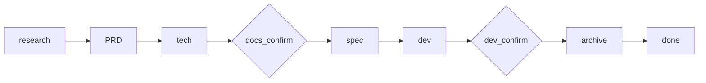

# spec-dev

[](#)
[](#installation)
[](#workflow)
[](LICENSE)

A requirement-to-delivery skill for **Codex** and **Claude Code**. Feed it a requirement description, and it drives the full pipeline: research, PRD, technical design, gated confirmation, task breakdown, code implementation, and archive.

Designed for Java backend microservices, works with any codebase.

## Quick Start

**Codex:**

```
$spec-dev 为订单服务新增按订单状态分页查询接口
```

**Claude Code:**

```
/spec-dev 为订单服务新增按订单状态分页查询接口
```

Both runtimes also accept plain text triggers:

```
spec-dev: 你的需求描述
spec-dev：你的需求描述
```

## Installation

```bash
# Codex
git clone https://github.com/KkOma-value/spec-dev-skill.git ~/.codex/skills/spec-dev

# Claude Code
git clone https://github.com/KkOma-value/spec-dev-skill.git ~/.claude/skills/spec-dev

# Both
git clone https://github.com/KkOma-value/spec-dev-skill.git ~/.codex/skills/spec-dev
git clone https://github.com/KkOma-value/spec-dev-skill.git ~/.claude/skills/spec-dev
```

## Workflow



Fixed phase chain:

```
research → prd → tech → docs_confirm → spec → dev → dev_confirm → archive → done
```

Two hard gates that require explicit user confirmation:

| Gate | When | What you review |
|------|------|-----------------|
| `docs_confirm` | After PRD + tech design | Approve or request changes to docs |
| `dev_confirm` | After all tasks implemented | Approve or request changes to code |

## What Each Phase Does

| Phase | Agent | Output |
|-------|-------|--------|
| **research** | `agents/researcher.md` | Local code analysis + web research (no file output) |
| **prd** | `agents/prd-writer.md` | `spec-dev/prd/{name}-prd.md` |
| **tech** | `agents/tech-writer.md` | `spec-dev/tech/{name}-tech.md` |
| **spec** | `agents/spec-generator.md` | `spec-dev/spec/{name}-tasks.md` |
| **dev** | — | Code changes, tasks marked `[x]` |
| **archive** | `references/archive-template.md` | `spec-dev/archive/YYYY-MM-DD-{name}.md` |

## State Recovery

The pipeline tracks progress in `spec-dev/.state.json`. If you trigger `spec-dev` again in a project that has an unfinished run, it resumes from the last recorded phase. Reply `确认`/`OK`/`继续` to advance past gates, or provide feedback to iterate on the current phase.

## Project Output

After a run, your project root contains:

```
spec-dev/
├── .state.json
├── prd/{name}-prd.md
├── tech/{name}-tech.md
├── spec/{name}-tasks.md
└── archive/YYYY-MM-DD-{name}.md
```

## Repository Structure

```
spec-dev-skill/
├── SKILL.md                  # Unified skill definition (Codex + Claude Code)
├── agents/
│   ├── openai.yaml           # Codex UI metadata
│   ├── researcher.md         # Research phase instructions
│   ├── prd-writer.md         # PRD writing instructions
│   ├── tech-writer.md        # Tech design instructions
│   └── spec-generator.md     # Task breakdown instructions
├── references/
│   ├── prd-template.md
│   ├── tech-template.md
│   ├── spec-template.md
│   └── archive-template.md
├── scripts/
│   └── archive.sh
└── LICENSE
```

## Key Design Decisions

- **Single `SKILL.md`** — one file works for both Codex and Claude Code. Codex reads `name`/`description`; Claude Code reads `when-to-use`/`allowed-tools`/`user-invocable`. Unrecognized frontmatter fields are silently ignored by each runtime.
- **Relative resource paths** — agents and templates are referenced relative to `SKILL.md`, not tied to any absolute directory.
- **Vertical task slicing** — tasks are split by feature path (DDL → Mapper → Service → Controller), not by layer, so each task delivers a testable increment.

## Contributing

Keep `SKILL.md` lean; put long templates in `references/` and detailed instructions in `agents/`. If you change trigger semantics, update the `description` field in `SKILL.md` and `agents/openai.yaml`.

## License

MIT. See [LICENSE](LICENSE).
