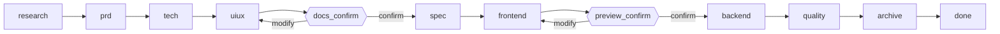

<!-- Hero -->
<div align="center">

<picture>
  <source media="(prefers-color-scheme: dark)" srcset="https://readme-typing-svg.demolab.com?font=JetBrains+Mono&weight=600&size=22&pause=1200&color=58A6FF&center=true&vCenter=true&multiline=true&repeat=true&width=800&height=150&lines=spec-dev+v3.0;Research+%E2%86%92+PRD+%E2%86%92+Tech+%E2%86%92+UIUX+%E2%86%92+Spec;Frontend+%E2%86%92+Backend+%E2%86%92+Quality+%E2%86%92+Archive;3+Modes+%7C+12+Phases+%7C+7+Agents+%7C+0+Dependencies" />
  <source media="(prefers-color-scheme: light)" srcset="https://readme-typing-svg.demolab.com?font=JetBrains+Mono&weight=600&size=22&pause=1200&color=0366D6&center=true&vCenter=true&multiline=true&repeat=true&width=800&height=150&lines=spec-dev+v3.0;Research+%E2%86%92+PRD+%E2%86%92+Tech+%E2%86%92+UIUX+%E2%86%92+Spec;Frontend+%E2%86%92+Backend+%E2%86%92+Quality+%E2%86%92+Archive;3+Modes+%7C+12+Phases+%7C+7+Agents+%7C+0+Dependencies" />
  
</picture>

<br />

<a href="https://github.com/KkOma-value/spec-dev-skill/stargazers">
  
</a>
<a href="https://github.com/KkOma-value/spec-dev-skill/network/members">
  
</a>

<br />
<br />


<br />


</div>

---

**spec-dev** turns a natural-language requirement into a complete delivery pipeline: research, documentation, UI/UX design, frontend & backend implementation, quality audit, and archive — all governed by a zero-dependency JS state machine that keeps context minimal by loading only what each phase needs.

## Why spec-dev?

| Problem | spec-dev's answer |
|---------|-------------------|
| AI loses track of multi-step workflows | `.state.json` persists phase, gate, and artifact state across sessions |
| Context window fills with irrelevant instructions | JS executor returns only the current phase's required reads |
| No design consistency across features | UI/UX phase locks icon library, typography, design tokens, and responsive breakpoints |
| Security reviews get skipped | Automated quality gate with 10-dimension OWASP scan, code review, build + coverage checks |
| One-size-fits-all pipeline | Three work modes: `new` (full), `evolve` (skip docs), `patch` (implementation only) |

## Pipeline


```mermaid
flowchart LR
  A[research] --> B[prd]
  B --> C[tech]
  C --> D[uiux]
  D --> E{{docs_confirm}}
  E -->|confirm| F[spec]
  E -->|modify| D
  F --> G[frontend]
  G --> H{{preview_confirm}}
  H -->|confirm| I[backend]
  H -->|modify| G
  I --> J[quality]
  J --> K[archive]
  K --> L[done]
```

### Gates

| Gate | Trigger | Action |
|------|---------|--------|
| `docs_confirm` | PRD + Tech + UIUX ready | User confirms or requests changes |
| `preview_confirm` | Frontend done | User confirms UI against design doc |
| `quality` | Backend done (automated) | Security + Code Review + Build + Coverage |

### Work Modes

| Mode | Start | Phases | For |
|------|-------|--------|-----|
| `new` | `research` | 12/12 | New features from scratch |
| `evolve` | `spec` | 7/12 | Iterate on existing PRD/Tech/UIUX docs |
| `patch` | `frontend` | 6/12 | Bug fixes, small changes |

## Quick Start

### Install

```bash
# Codex
git clone https://github.com/KkOma-value/spec-dev-skill.git ~/.codex/skills/spec-dev

# Claude Code
git clone https://github.com/KkOma-value/spec-dev-skill.git ~/.claude/skills/spec-dev
```

Requires Node.js 18+. Zero `npm install`.

### Use

```text
# New feature (full pipeline)
/spec-dev Add paginated order-status query API

# Quick fix (patch mode — skip docs)
/spec-dev Fix login redirect loop --mode patch

# Iterate on existing design (evolve mode)
/spec-dev Add export to CSV --mode evolve
```

Plain text also works: `$spec-dev ...`, `spec-dev: ...`, `spec-dev：...`

### What happens

```
Each turn, the AI runs:
  node scripts/spec-dev.mjs next --root <project>

The JS executor reads spec-dev/.state.json and returns:
  → current phase, required files to read, expected output, next command

Only those files are loaded. Context stays small.
```

## Architecture

```text
spec-dev-skill/
├── SKILL.md                     # Entry point — trigger + orchestration contract
├── agents/                      # Expert instruction files (loaded on demand)
│   ├── researcher.md            #   Phase 1  — Code analysis + web research
│   ├── prd-writer.md            #   Phase 2  — Product requirements doc
│   ├── tech-writer.md           #   Phase 3  — Technical design + alternatives
│   ├── ui-designer.md           #   Phase 4  — Design system + pages + states
│   ├── spec-generator.md        #   Phase 6  — Vertical-slice task breakdown
│   ├── quality-reviewer.md      #   Phase 10 — 5-category quality audit
│   └── security-reviewer.md     #   Phase 10 — OWASP Top 10 security scan
├── references/                  # Document templates
│   ├── prd-template.md
│   ├── tech-template.md
│   ├── uiux-template.md         #   11-section UI/UX spec with design tokens
│   ├── spec-template.md
│   ├── quality-checklist.md     #   7-section quality gate checklist
│   └── archive-template.md
├── scripts/
│   └── spec-dev.mjs             # Zero-dep state machine (12 phases, 3 modes)
└── test/
    └── spec-dev.test.mjs        # 19 tests covering all phases + modes + gates
```

### Project output

A completed `new` mode run produces:

```text
{project}/spec-dev/
├── .state.json                  # State machine (schema v2)
├── prd/{name}-prd.md
├── tech/{name}-tech.md
├── uiux/{name}-uiux.md
├── spec/{name}-tasks.md
├── quality/{name}-quality-report.md
└── archive/{date}-{name}.md
```

## Agents

| Agent | Phase | Role |
|-------|-------|------|
| `researcher` | 1 | Dual-engine code analysis + web research with evidence grading |
| `prd-writer` | 2 | PRD with user stories, acceptance criteria, quantified NFRs |
| `tech-writer` | 3 | Design alternatives, Mermaid sequence diagrams, DDL, API contracts |
| `ui-designer` | 4 | Icon library, design tokens (15+ colors), 5 interaction states per page |
| `spec-generator` | 6 | Vertical-slice task breakdown with dependency ordering |
| `quality-reviewer` | 10 | Security + Code review + Build + Coverage + Spec consistency |
| `security-reviewer` | 10 | OWASP Top 10, hardcoded credentials, SQL injection, XSS, CSRF, path traversal |

## CLI Reference

```bash
node scripts/spec-dev.mjs init --root <dir> --requirement "<text>" [--mode new|evolve|patch]
node scripts/spec-dev.mjs next --root <dir>
node scripts/spec-dev.mjs advance --root <dir> --completed <phase> [--artifact <kind=path>]
node scripts/spec-dev.mjs gate --root <dir> --confirm <docs_confirm|preview_confirm>
node scripts/spec-dev.mjs archive --root <dir>
node scripts/spec-dev.mjs validate --root <dir>
```

All commands write JSON to stdout. Errors return JSON with `code` + `message` and non-zero exit.

### Example session

```bash
node scripts/spec-dev.mjs init --root . --requirement "Add order status query"
# → phase: research, reads: agents/researcher.md

node scripts/spec-dev.mjs advance --root . --completed research
# → phase: prd

node scripts/spec-dev.mjs advance --root . --completed prd --artifact prd=spec-dev/prd/order-status-prd.md
# → phase: tech

# ... complete tech, uiux ...

node scripts/spec-dev.mjs gate --root . --confirm docs_confirm
# → phase: spec

node scripts/spec-dev.mjs advance --root . --completed spec --artifact spec=spec-dev/spec/order-status-tasks.md
# → phase: frontend

node scripts/spec-dev.mjs advance --root . --completed frontend
# → phase: preview_confirm

node scripts/spec-dev.mjs gate --root . --confirm preview_confirm
# → phase: backend

node scripts/spec-dev.mjs advance --root . --completed backend
# → phase: quality

node scripts/spec-dev.mjs advance --root . --completed quality --artifact quality=spec-dev/quality/order-status-quality-report.md
# → phase: archive

node scripts/spec-dev.mjs archive --root .
# → phase: done
```

## Design Principles

| Principle | Implementation |
|-----------|---------------|
| **Zero dependencies** | `spec-dev.mjs` uses only Node.js built-ins (`fs/promises`, `path`, `child_process`) |
| **Lazy context loading** | Each phase returns exactly the files it needs; no global instruction dump |
| **State persistence** | `.state.json` survives session restarts; resume from any phase |
| **Gated progression** | Three hard gates prevent skipping review or confirmation |
| **Evidence over speculation** | Research phase grades facts/analysis/gaps/conflicts; no guessing |
| **Artifact traceability** | Every design element traces back to a PRD requirement |

## Testing

```bash
node --test test/spec-dev.test.mjs
```

19 tests covering: init (3 modes), next (12 phases), advance ordering + artifact enforcement, gate confirmation (docs + preview), archive generation + validation, patch mode lightweight paths, error states.

## License

[MIT](LICENSE) © 2025 KkOma-value

---

<div align="center">
<sub>Built with Node.js · Zero dependencies · 12 phases · 3 work modes · 7 expert agents</sub>
</div>
