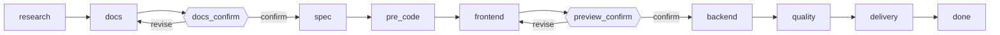

<div align="center">

<sub>English · <a href="README.zh.md">简体中文</a></sub>

# spec-dev

**Turn a natural-language requirement into research, specs, code, and a delivery report — through hard governance gates.**

A zero-dependency skill for Codex and Claude Code that drives the whole delivery loop: research → three core docs → task planning → frontend-first implementation → backend → quality checks → delivery.

<p>
  <a href="LICENSE"></a>
  
  = 18">
  
  
</p>

<p>
  <a href="#quick-start">Quick Start</a> ·
  <a href="#pipeline">Pipeline</a> ·
  <a href="#work-modes">Work Modes</a> ·
  <a href="#cli-reference">CLI</a> ·
  <a href="SKILL.md">Skill Spec</a>
</p>

</div>

---

## Why spec-dev

- **Zero dependencies.** One `.mjs` executor built on Node.js built-ins. No `npm install`, no lockfile, no supply chain.
- **Governed, not freeform.** Four hard gates — docs, pre-code, preview, quality — stop the agent from skipping work or jumping straight to code.
- **Frontend first.** UI is built and confirmed against the UI/UX doc before any backend code is written.
- **Fully traceable.** Research, PRD, architecture, UI/UX, tasks, quality, and delivery are linked end to end.
- **Resumable.** State lives in `.spec-dev/state.json`, so a run survives across sessions.
- **Lean context.** Each phase returns only the files that phase needs to read.
- **Fast verification.** Tasks run targeted checks; each side runs full checks once per code fingerprint and quality reuses fresh evidence.

## Pipeline


```mermaid
flowchart LR
  A[research] --> B[docs]
  B --> C{{docs_confirm}}
  C -->|confirm| D[spec]
  C -->|revise| B
  D --> E[pre_code]
  E --> F[frontend]
  F --> G{{preview_confirm}}
  G -->|confirm| H[backend]
  G -->|revise| F
  H --> I[quality]
  I --> J[delivery]
  J --> K[done]
```

`evolve` and `patch` modes start with a `baseline` step, then continue through the same governed flow.

## Quick Start

```bash
# Claude Code
git clone https://github.com/KkOma-value/spec-dev-skill.git ~/.claude/skills/spec-dev

# Codex
git clone https://github.com/KkOma-value/spec-dev-skill.git ~/.codex/skills/spec-dev
```

Then, inside your agent, describe what you want:

```text
/spec-dev Add a paginated order-status query API
```

Requires Node.js 18+. No build step, no `npm install`.

Trigger styles are interchangeable: `/spec-dev …`, `$spec-dev …`, `spec-dev: …`, `spec-dev：…`. Run it with no arguments to resume an unfinished flow from `.spec-dev/state.json`.

```text
/spec-dev Fix login redirect loop --mode patch
/spec-dev Add export to CSV --mode evolve
```

## Work Modes

| Mode | Starts at | Use case |
|------|-----------|----------|
| `new` | `research` | New feature or product work |
| `evolve` | `baseline` | Incremental work on an existing project |
| `patch` | `baseline` | Bug fixes and remediation |

## What It Produces

```text
{project}/.spec-dev/
├── state.json
├── SESSION_BRIEF.md
├── PRE_CODE_CHECKLIST.md
├── VALIDATION_PLAN.json
├── verification.json
└── changes/{requirement_name}/
    ├── proposal.md
    └── tasks.md

{project}/output/
├── {requirement_name}-research.md
├── {requirement_name}-prd.md
├── {requirement_name}-architecture.md
├── {requirement_name}-uiux.md
├── {requirement_name}-quality-report.md
└── {YYYY-MM-DD}-{requirement_name}-delivery.md
```

## Design Principles

| Principle | How it works |
|-----------|--------------|
| Zero dependencies | `scripts/spec-dev.mjs` uses only Node.js built-ins |
| Small context | Each phase returns only the files needed for that phase |
| Persistent state | `.spec-dev/state.json` supports recovery across sessions |
| Hard gates | Docs, pre-code, preview, and quality gates prevent skipped work |
| Frontend first | UI is completed and confirmed before backend implementation |
| Traceability | Research → PRD → architecture → UI/UX → tasks → quality → delivery are linked |
| Deduplicated verification | Frontend/backend fingerprints keep build, test, and coverage to once per unchanged input state |

## CLI Reference

<details>
<summary>Commands the skill runs under the hood</summary>

```bash
node scripts/spec-dev.mjs init --root <dir> --requirement "<text>" [--mode new|evolve|patch]
node scripts/spec-dev.mjs next --root <dir>
node scripts/spec-dev.mjs advance --root <dir> --completed <phase> [--artifact <kind=path>]
node scripts/spec-dev.mjs gate --root <dir> --confirm <docs_confirm|preview_confirm>
node scripts/spec-dev.mjs deliver --root <dir>
node scripts/spec-dev.mjs archive --root <dir>   # compatibility alias for deliver
node scripts/spec-dev.mjs validate --root <dir>
node scripts/spec-dev.mjs verify --root <dir> --scope <frontend|backend> --level full
node scripts/spec-dev.mjs verify-status --root <dir> [--scope <frontend|backend>]
```

Artifact kinds: `research`, `prd`, `architecture`, `uiux`, `proposal`, `tasks`, `quality`, `delivery`.

</details>

<details>
<summary>End-to-end example session</summary>

```bash
node scripts/spec-dev.mjs init --root . --requirement "Add order status query"
node scripts/spec-dev.mjs advance --root . --completed research --artifact research=output/add-order-status-query-research.md
node scripts/spec-dev.mjs advance --root . --completed docs --artifact prd=output/add-order-status-query-prd.md --artifact architecture=output/add-order-status-query-architecture.md --artifact uiux=output/add-order-status-query-uiux.md
node scripts/spec-dev.mjs gate --root . --confirm docs_confirm
node scripts/spec-dev.mjs advance --root . --completed spec --artifact proposal=.spec-dev/changes/add-order-status-query/proposal.md --artifact tasks=.spec-dev/changes/add-order-status-query/tasks.md
# Write .spec-dev/VALIDATION_PLAN.json from references/validation-plan.md and complete PRE_CODE_CHECKLIST.md
node scripts/spec-dev.mjs advance --root . --completed pre_code
node scripts/spec-dev.mjs verify --root . --scope frontend --level full
node scripts/spec-dev.mjs advance --root . --completed frontend
node scripts/spec-dev.mjs gate --root . --confirm preview_confirm
node scripts/spec-dev.mjs verify --root . --scope backend --level full
node scripts/spec-dev.mjs advance --root . --completed backend
node scripts/spec-dev.mjs verify-status --root .
node scripts/spec-dev.mjs advance --root . --completed quality --artifact quality=output/add-order-status-query-quality-report.md
node scripts/spec-dev.mjs deliver --root .
```

</details>

## Testing

```bash
node --test test/spec-dev.test.mjs
```

## License

[MIT](LICENSE)
