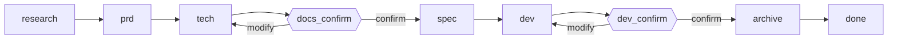

<!-- Hero -->
<div align="center">

<picture>
  <source media="(prefers-color-scheme: dark)" srcset="https://readme-typing-svg.demolab.com?font=Fira+Code&weight=600&size=28&pause=1200&color=58A6FF&center=true&vCenter=true&multiline=true&repeat=true&width=780&height=120&lines=spec-dev;Requirement+%E2%86%92+Research+%E2%86%92+PRD+%E2%86%92+Code+%E2%86%92+Archive;JS-loaded+Skill+Pipeline;For+Codex+%26+Claude+Code" />
  <source media="(prefers-color-scheme: light)" srcset="https://readme-typing-svg.demolab.com?font=Fira+Code&weight=600&size=28&pause=1200&color=0366D6&center=true&vCenter=true&multiline=true&repeat=true&width=780&height=120&lines=spec-dev;Requirement+%E2%86%92+Research+%E2%86%92+PRD+%E2%86%92+Code+%E2%86%92+Archive;JS-loaded+Skill+Pipeline;For+Codex+%26+Claude+Code" />
  
</picture>

<br />

<a href="https://github.com/KkOma-value/spec-dev-skill/stargazers">
  
</a>
<a href="https://github.com/KkOma-value/spec-dev-skill/network/members">
  
</a>

<br /><br />


<a href="LICENSE"></a>

</div>

---

**spec-dev** is a requirement-to-delivery skill for Codex and Claude Code. Instead of loading the entire workflow into context every turn, a thin `SKILL.md` delegates to a zero-dependency Node.js executor that returns only the current phase's instructions.

## Workflow


```mermaid
flowchart LR
  A[research] --> B[prd]
  B --> C[tech]
  C --> D{{docs_confirm}}
  D -->|confirm| E[spec]
  D -->|modify| C
  E --> F[dev]
  F --> G{{dev_confirm}}
  G -->|confirm| H[archive]
  G -->|modify| F
  H --> I[done]
```

Two hard gates cannot be skipped:

| Gate | When | User action |
|------|------|-------------|
| `docs_confirm` | After PRD + Tech docs are ready | Confirm or request changes |
| `dev_confirm` | After implementation is done | Confirm or request changes |

## Quick Start

```bash
# Codex
git clone https://github.com/KkOma-value/spec-dev-skill.git ~/.codex/skills/spec-dev

# Claude Code
git clone https://github.com/KkOma-value/spec-dev-skill.git ~/.claude/skills/spec-dev
```

Requires Node.js 18+. No `npm install` needed.

**Codex:**

```text
$spec-dev Add paginated order-status query API for the order service
```

**Claude Code:**

```text
/spec-dev Add paginated order-status query API for the order service
```

Plain text also works: `spec-dev: <your requirement>` or `spec-dev：<your requirement>`.

## How It Works

The entry file (`SKILL.md`) defines the trigger and orchestration contract. Each turn, the AI runs:

```bash
node <skill-root>/scripts/spec-dev.mjs next --root <project-root>
```

The executor reads `spec-dev/.state.json` and returns:

```json
{
  "phase": "prd",
  "current_gate": null,
  "required_reads": ["agents/prd-writer.md", "references/prd-template.md"],
  "required_read_files": [
    "/absolute/skill-root/agents/prd-writer.md",
    "/absolute/skill-root/references/prd-template.md"
  ],
  "expected_output": "spec-dev/prd/add-status-query-api-prd.md",
  "expected_output_file": "/absolute/project-root/spec-dev/prd/add-status-query-api-prd.md",
  "project_root": "/absolute/project-root",
  "message": "Read PRD agent instructions and template, write PRD to expected_output_file, then advance."
}
```

The AI reads only the files listed in `required_read_files` when present. `required_reads` remains as a portable compatibility field:
- `agents/*` and `references/*` resolve relative to the skill directory.
- `spec-dev/*` files resolve relative to the target project root.

Generated documents must be written to `expected_output_file`, the absolute path under `project_root`. State remains portable: when advancing `prd`, `tech`, or `spec`, pass the project-relative `expected_output` as the artifact value.

Context stays small — only the files relevant to the current phase are loaded.

## CLI Reference

The executor uses only Node.js built-in modules (zero dependencies):

```bash
node scripts/spec-dev.mjs init --root <projectRoot> --requirement "<text>"
node scripts/spec-dev.mjs next --root <projectRoot>
node scripts/spec-dev.mjs advance --root <projectRoot> --completed <phase> [--artifact <kind=path>]
node scripts/spec-dev.mjs gate --root <projectRoot> --confirm <docs_confirm|dev_confirm>
node scripts/spec-dev.mjs archive --root <projectRoot>
node scripts/spec-dev.mjs validate --root <projectRoot>
```

All commands print JSON to stdout. Errors also print JSON and return a non-zero exit code. `--root` is the source of truth for project output: use the explicit target project path when one is provided, otherwise use the current project workspace root.

`--artifact` is required when completing `prd`, `tech`, or `spec`. It may be relative or absolute, but it must resolve inside `--root`; the executor stores it as a project-relative POSIX path in `.state.json`. The `archive` phase has its own dedicated `archive` command to ensure the archive file is generated.

### Typical Session

```bash
node scripts/spec-dev.mjs init --root . --requirement "Add order status query"
node scripts/spec-dev.mjs next --root .
node scripts/spec-dev.mjs advance --root . --completed research
node scripts/spec-dev.mjs advance --root . --completed prd --artifact prd=spec-dev/prd/order-status-prd.md
node scripts/spec-dev.mjs advance --root . --completed tech --artifact tech=spec-dev/tech/order-status-tech.md
node scripts/spec-dev.mjs gate --root . --confirm docs_confirm
node scripts/spec-dev.mjs advance --root . --completed spec --artifact spec=spec-dev/spec/order-status-tasks.md
node scripts/spec-dev.mjs advance --root . --completed dev
node scripts/spec-dev.mjs gate --root . --confirm dev_confirm
node scripts/spec-dev.mjs archive --root .
```

## Project Output

A completed run produces the following in the target project:

```text
spec-dev/
├── .state.json          # State machine (phase, artifacts, gate status)
├── prd/
│   └── <name>-prd.md
├── tech/
│   └── <name>-tech.md
├── spec/
│   └── <name>-tasks.md
└── archive/
    └── <date>-<name>.md
```

`.state.json` includes `schema_version: 1`, current phase, original requirement, generated slug name, completed phases, gate state, and project-relative artifact paths.

## Repository Structure

```text
spec-dev-skill/
├── SKILL.md                  # Thin trigger + JS orchestration contract
├── agents/
│   ├── openai.yaml           # Codex agent manifest
│   ├── researcher.md         # Deep-research phase instructions
│   ├── prd-writer.md         # PRD generation agent
│   ├── tech-writer.md        # Technical design agent
│   └── spec-generator.md     # Task breakdown agent
├── references/
│   ├── prd-template.md
│   ├── tech-template.md
│   ├── spec-template.md
│   └── archive-template.md
├── scripts/
│   ├── spec-dev.mjs          # State machine, lazy-load hints, validation, archive
│   └── archive.sh            # Deprecated compatibility wrapper
└── test/
    └── spec-dev.test.mjs     # Covers init, phases, gates, archive, validation
```

## Testing

```bash
node --test test/spec-dev.test.mjs
```

Covers initialization, per-phase lazy-read hints, phase advancement order, gate confirmation, archive generation, and validation failure modes.

## License

[MIT](LICENSE)
