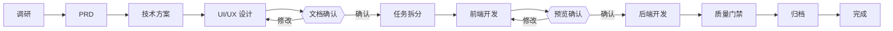

<!-- Hero -->
<div align="center">

<picture>
  <source media="(prefers-color-scheme: dark)" srcset="https://readme-typing-svg.demolab.com?font=JetBrains+Mono&weight=600&size=22&pause=1200&color=58A6FF&center=true&vCenter=true&multiline=true&repeat=true&width=800&height=150&lines=spec-dev+v3.0;%E9%9C%80%E6%B1%82%E8%B0%83%E7%A0%94+%E2%86%92+PRD+%E2%86%92+%E6%8A%80%E6%9C%AF%E6%96%B9%E6%A1%88+%E2%86%92+UI%2FUX+%E2%86%92+%E4%BB%BB%E5%8A%A1%E6%8B%86%E5%88%86;%E5%89%8D%E7%AB%AF+%E2%86%92+%E9%A2%84%E8%A7%88%E7%A1%AE%E8%AE%A4+%E2%86%92+%E5%90%8E%E7%AB%AF+%E2%86%92+%E8%B4%A8%E9%87%8F%E9%97%A8%E7%A6%81+%E2%86%92+%E5%BD%92%E6%A1%A3;3+%E7%A7%8D%E5%B7%A5%E4%BD%9C%E6%A8%A1%E5%BC%8F+%7C+12+%E9%98%B6%E6%AE%B5+%7C+7+%E4%B8%93%E5%AE%B6%E4%BB%A3%E7%90%86+%7C+%E9%9B%B6%E4%BE%9D%E8%B5%96" />
  <source media="(prefers-color-scheme: light)" srcset="https://readme-typing-svg.demolab.com?font=JetBrains+Mono&weight=600&size=22&pause=1200&color=0366D6&center=true&vCenter=true&multiline=true&repeat=true&width=800&height=150&lines=spec-dev+v3.0;%E9%9C%80%E6%B1%82%E8%B0%83%E7%A0%94+%E2%86%92+PRD+%E2%86%92+%E6%8A%80%E6%9C%AF%E6%96%B9%E6%A1%88+%E2%86%92+UI%2FUX+%E2%86%92+%E4%BB%BB%E5%8A%A1%E6%8B%86%E5%88%86;%E5%89%8D%E7%AB%AF+%E2%86%92+%E9%A2%84%E8%A7%88%E7%A1%AE%E8%AE%A4+%E2%86%92+%E5%90%8E%E7%AB%AF+%E2%86%92+%E8%B4%A8%E9%87%8F%E9%97%A8%E7%A6%81+%E2%86%92+%E5%BD%92%E6%A1%A3;3+%E7%A7%8D%E5%B7%A5%E4%BD%9C%E6%A8%A1%E5%BC%8F+%7C+12+%E9%98%B6%E6%AE%B5+%7C+7+%E4%B8%93%E5%AE%B6%E4%BB%A3%E7%90%86+%7C+%E9%9B%B6%E4%BE%9D%E8%B5%96" />
  
</picture>

<br />

<a href="https://github.com/KkOma-value/spec-dev-skill/stargazers">
  
</a>
<a href="https://github.com/KkOma-value/spec-dev-skill/network/members">
  
</a>

<br />
<br />


<br />


</div>

---

**spec-dev** 是一个需求到交付的全流程 AI 编码 Skill。它将自然语言需求转化为完整的开发流水线：调研 → 文档 → UI/UX 设计 → 前后端实现 → 质量审计 → 归档——全部由零依赖的 JS 状态机驱动，每次只加载当前阶段所需的上下文，保持轻量高效。

> 📖 [English version](README.md)

## 为什么选择 spec-dev？

| 痛点 | spec-dev 的解法 |
|------|----------------|
| AI 在多步工作流中丢失上下文 | `.state.json` 跨会话持久化阶段、门禁与产物状态 |
| 上下文窗口被无关指令占满 | JS 执行器每次只返回当前阶段需要读取的文件 |
| 各功能设计风格不一致 | UI/UX 阶段锁定图标库、排版、设计 Token 和响应式断点 |
| 安全审查被遗漏 | 自动化质量门禁：10 维度 OWASP 扫描 + 代码审查 + 构建 + 覆盖率 |
| 所有需求同一套流程 | 三种工作模式：`new`（完整）/ `evolve`（续建）/ `patch`（快速修复） |

## 流水线



### 门禁

| 门禁 | 触发时机 | 操作 |
|------|---------|------|
| `docs_confirm` | PRD + 技术方案 + UI/UX 就绪 | 用户确认或提出修改 |
| `preview_confirm` | 前端开发完成 | 用户确认 UI 与设计文档一致 |
| `quality` | 后端开发完成（自动执行） | 安全 + 代码审查 + 构建 + 覆盖率 |

### 工作模式

| 模式 | 起点 | 阶段数 | 适用场景 |
|------|------|--------|---------|
| `new` | `research` | 12/12 | 全新需求，完整流水线 |
| `evolve` | `spec` | 7/12 | 已有 PRD/Tech/UIUX 文档，继续开发 |
| `patch` | `frontend` | 6/12 | Bug 修复、小改动、紧急补丁 |

## 快速开始

### 安装

```bash
# Codex
git clone https://github.com/KkOma-value/spec-dev-skill.git ~/.codex/skills/spec-dev

# Claude Code
git clone https://github.com/KkOma-value/spec-dev-skill.git ~/.claude/skills/spec-dev
```

需要 Node.js 18+。无需 `npm install`。

### 使用

```text
# 全新需求（完整流水线）
/spec-dev 为订单服务新增按订单状态分页查询接口

# 快速修复（patch 模式 — 跳过文档阶段）
/spec-dev 修复登录页跳转循环 --mode patch

# 基于已有设计续建（evolve 模式）
/spec-dev 增加导出 CSV 功能 --mode evolve
```

也支持：`$spec-dev ...`、`spec-dev: ...`、`spec-dev：...`

### 工作原理

```
每次对话，AI 执行：
  node scripts/spec-dev.mjs next --root <项目目录>

JS 执行器读取 spec-dev/.state.json 并返回：
  → 当前阶段、需要读取的文件、预期产出、下一步命令

只加载这些文件。上下文始终保持最小化。
```

## 架构

```text
spec-dev-skill/
├── SKILL.md                     # 入口 —— 触发方式 + 调度契约
├── agents/                      # 专家指令文件（按需加载）
│   ├── researcher.md            #   阶段 1  — 双引擎调研（代码分析 + 联网搜索）
│   ├── prd-writer.md            #   阶段 2  — 产品需求文档撰写
│   ├── tech-writer.md           #   阶段 3  — 技术方案设计 + 备选方案对比
│   ├── ui-designer.md           #   阶段 4  — 设计系统 + 页面结构 + 交互状态
│   ├── spec-generator.md        #   阶段 6  — 纵向切片任务拆分
│   ├── quality-reviewer.md      #   阶段 10 — 五维质量审查
│   └── security-reviewer.md     #   阶段 10 — OWASP Top 10 安全扫描
├── references/                  # 文档模板
│   ├── prd-template.md
│   ├── tech-template.md
│   ├── uiux-template.md         #   11 章节 UI/UX 设计规范模板
│   ├── spec-template.md
│   ├── quality-checklist.md     #   7 大类质量检查清单
│   └── archive-template.md
├── scripts/
│   └── spec-dev.mjs             # 零依赖状态机（12 阶段、3 模式）
└── test/
    └── spec-dev.test.mjs        # 19 个测试覆盖全部阶段、模式与门禁
```

### 项目产出

`new` 模式完成后的产物结构：

```text
{项目根目录}/spec-dev/
├── .state.json                  # 状态机（schema v2）
├── prd/{名称}-prd.md
├── tech/{名称}-tech.md
├── uiux/{名称}-uiux.md
├── spec/{名称}-tasks.md
├── quality/{名称}-quality-report.md
└── archive/{日期}-{名称}.md
```

## 专家代理

| 代理 | 阶段 | 职责 |
|------|------|------|
| `researcher` | 1 | 双引擎调研：代码分析 + 联网搜索，证据分级输出 |
| `prd-writer` | 2 | PRD：用户故事、验收标准、可量化非功能需求 |
| `tech-writer` | 3 | 技术方案：备选方案对比、Mermaid 时序图、DDL、API 契约 |
| `ui-designer` | 4 | UI/UX 设计：图标库锁定、设计 Token（15+ 色）、每页 5 种交互状态 |
| `spec-generator` | 6 | 任务拆分：纵向切片、依赖排序、检查点设置 |
| `quality-reviewer` | 10 | 质量审查：安全 + 代码审查 + 构建 + 覆盖率 + Spec 一致性 |
| `security-reviewer` | 10 | 安全扫描：OWASP Top 10、硬编码凭证、SQL 注入、XSS、CSRF、路径穿越 |

## CLI 参考

```bash
node scripts/spec-dev.mjs init --root <目录> --requirement "<需求描述>" [--mode new|evolve|patch]
node scripts/spec-dev.mjs next --root <目录>
node scripts/spec-dev.mjs advance --root <目录> --completed <阶段> [--artifact <类型=路径>]
node scripts/spec-dev.mjs gate --root <目录> --confirm <docs_confirm|preview_confirm>
node scripts/spec-dev.mjs archive --root <目录>
node scripts/spec-dev.mjs validate --root <目录>
```

所有命令输出 JSON 到 stdout。错误同样输出 JSON，包含 `code` + `message`，返回非零退出码。

### 典型会话示例

```bash
node scripts/spec-dev.mjs init --root . --requirement "新增订单状态查询"
# → phase: research, reads: agents/researcher.md

node scripts/spec-dev.mjs advance --root . --completed research
# → phase: prd

node scripts/spec-dev.mjs advance --root . --completed prd --artifact prd=spec-dev/prd/order-status-prd.md
# → phase: tech

# ... 依次完成 tech、uiux ...

node scripts/spec-dev.mjs gate --root . --confirm docs_confirm
# → phase: spec

node scripts/spec-dev.mjs advance --root . --completed spec --artifact spec=spec-dev/spec/order-status-tasks.md
# → phase: frontend

node scripts/spec-dev.mjs advance --root . --completed frontend
# → phase: preview_confirm

node scripts/spec-dev.mjs gate --root . --confirm preview_confirm
# → phase: backend

node scripts/spec-dev.mjs advance --root . --completed backend
# → phase: quality

node scripts/spec-dev.mjs advance --root . --completed quality --artifact quality=spec-dev/quality/order-status-quality-report.md
# → phase: archive

node scripts/spec-dev.mjs archive --root .
# → phase: done
```

## 设计原则

| 原则 | 实现方式 |
|------|---------|
| **零依赖** | `spec-dev.mjs` 仅使用 Node.js 内置模块（`fs/promises`、`path`） |
| **按需加载** | 每个阶段只返回当前需要的文件清单，不做全文加载 |
| **状态持久化** | `.state.json` 跨会话保存，支持从任意阶段恢复 |
| **门禁推进** | 三道硬门禁，不允许跳过审查或确认 |
| **证据优先** | 调研阶段对事实/分析/缺口/冲突进行分级，不做无依据推测 |
| **产物可追溯** | 每个设计元素可追溯到 PRD 中的具体需求点 |

## 测试

```bash
node --test test/spec-dev.test.mjs
```

19 个测试覆盖：init（3 种模式）、next（12 阶段）、advance 顺序与 artifact 强制校验、gate 确认（docs + preview）、archive 生成与验证、patch 模式轻量化路径、各错误状态。

## 许可

[MIT](LICENSE) © 2025 KkOma-value

---

<div align="center">
<sub>基于 Node.js 构建 · 零依赖 · 12 阶段 · 3 种工作模式 · 7 个专家代理</sub>
</div>
