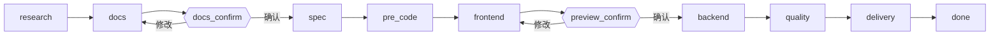

<div align="center">

<sub><a href="README.md">English</a> · 简体中文</sub>

# spec-dev

**把一句自然语言需求，经过硬性治理门禁，变成调研、规格、代码和交付报告。**

一个面向 Codex 和 Claude Code 的零依赖 Skill，驱动完整交付闭环：调研 → 三份核心文档 → 任务拆分 → 前端优先实现 → 后端 → 质量门禁 → 交付。

<p>
  <a href="LICENSE"></a>
  
  = 18">
  
  
</p>

<p>
  <a href="#快速开始">快速开始</a> ·
  <a href="#流水线">流水线</a> ·
  <a href="#工作模式">工作模式</a> ·
  <a href="#cli-参考">CLI</a> ·
  <a href="SKILL.md">Skill 规格</a>
</p>

</div>

---

## 为什么用 spec-dev

- **零依赖。** 一个基于 Node.js 内置模块的 `.mjs` 执行器。无需 `npm install`，没有 lockfile，没有供应链风险。
- **治理而非放养。** 文档、编码前、预览、质量四道硬门禁，阻止 Agent 跳步或直接开写代码。
- **前端优先。** 先对照 UI/UX 文档完成并确认前端，再写任何后端代码。
- **全链路可追溯。** Research、PRD、Architecture、UI/UX、Tasks、Quality、Delivery 端到端关联。
- **可恢复。** 状态保存在 `.spec-dev/state.json`，流程可跨会话续接。
- **精简上下文。** 每个阶段只返回该阶段需要读取的文件。

## 流水线



`evolve` 和 `patch` 模式先进入 `baseline` 步骤，确认现有项目边界、差量范围或缺陷范围，再进入同一条治理流程。

## 快速开始

```bash
# Claude Code
git clone https://github.com/KkOma-value/spec-dev-skill.git ~/.claude/skills/spec-dev

# Codex
git clone https://github.com/KkOma-value/spec-dev-skill.git ~/.codex/skills/spec-dev
```

然后在 Agent 里直接描述你的需求：

```text
/spec-dev 为订单服务新增按状态分页查询接口
```

需要 Node.js 18+。无构建步骤，无需 `npm install`。

触发方式可互换：`/spec-dev …`、`$spec-dev …`、`spec-dev: …`、`spec-dev：…`。不带参数运行时，会从 `.spec-dev/state.json` 恢复未完成的流程。

```text
/spec-dev 修复登录页跳转循环 --mode patch
/spec-dev 增加导出 CSV 功能 --mode evolve
```

## 工作模式

| 模式 | 起点 | 适用场景 |
|------|------|----------|
| `new` | `research` | 全新功能或产品需求 |
| `evolve` | `baseline` | 既有项目的增量开发 |
| `patch` | `baseline` | Bug 修复和质量整改 |

## 产物结构

```text
{项目根目录}/.spec-dev/
├── state.json
├── SESSION_BRIEF.md
├── PRE_CODE_CHECKLIST.md
└── changes/{requirement_name}/
    ├── proposal.md
    └── tasks.md

{项目根目录}/output/
├── {requirement_name}-research.md
├── {requirement_name}-prd.md
├── {requirement_name}-architecture.md
├── {requirement_name}-uiux.md
├── {requirement_name}-quality-report.md
└── {YYYY-MM-DD}-{requirement_name}-delivery.md
```

## 设计原则

| 原则 | 实现方式 |
|------|----------|
| 零依赖 | `scripts/spec-dev.mjs` 只使用 Node.js 内置模块 |
| 按需加载 | 每个阶段只返回当前需要读取的文件 |
| 状态持久化 | `.spec-dev/state.json` 支持跨会话恢复 |
| 硬门禁 | 文档、编码前、预览和质量门禁阻止跳步 |
| 前端优先 | 前端实现与预览确认后再进入后端 |
| 可追溯 | Research → PRD → Architecture → UI/UX → Tasks → Quality → Delivery 全链路关联 |

## CLI 参考

<details>
<summary>Skill 在底层运行的命令</summary>

```bash
node scripts/spec-dev.mjs init --root <目录> --requirement "<需求描述>" [--mode new|evolve|patch]
node scripts/spec-dev.mjs next --root <目录>
node scripts/spec-dev.mjs advance --root <目录> --completed <阶段> [--artifact <类型=路径>]
node scripts/spec-dev.mjs gate --root <目录> --confirm <docs_confirm|preview_confirm>
node scripts/spec-dev.mjs deliver --root <目录>
node scripts/spec-dev.mjs archive --root <目录>   # deliver 的兼容别名
node scripts/spec-dev.mjs validate --root <目录>
```

Artifact 类型：`research`、`prd`、`architecture`、`uiux`、`proposal`、`tasks`、`quality`、`delivery`。

</details>

<details>
<summary>端到端会话示例</summary>

```bash
node scripts/spec-dev.mjs init --root . --requirement "新增订单状态查询"
node scripts/spec-dev.mjs advance --root . --completed research --artifact research=output/xin-zeng-ding-dan-zhuang-tai-cha-xun-research.md
node scripts/spec-dev.mjs advance --root . --completed docs --artifact prd=output/xin-zeng-ding-dan-zhuang-tai-cha-xun-prd.md --artifact architecture=output/xin-zeng-ding-dan-zhuang-tai-cha-xun-architecture.md --artifact uiux=output/xin-zeng-ding-dan-zhuang-tai-cha-xun-uiux.md
node scripts/spec-dev.mjs gate --root . --confirm docs_confirm
node scripts/spec-dev.mjs advance --root . --completed spec --artifact proposal=.spec-dev/changes/xin-zeng-ding-dan-zhuang-tai-cha-xun/proposal.md --artifact tasks=.spec-dev/changes/xin-zeng-ding-dan-zhuang-tai-cha-xun/tasks.md
node scripts/spec-dev.mjs advance --root . --completed pre_code
node scripts/spec-dev.mjs advance --root . --completed frontend
node scripts/spec-dev.mjs gate --root . --confirm preview_confirm
node scripts/spec-dev.mjs advance --root . --completed backend
node scripts/spec-dev.mjs advance --root . --completed quality --artifact quality=output/xin-zeng-ding-dan-zhuang-tai-cha-xun-quality-report.md
node scripts/spec-dev.mjs deliver --root .
```

</details>

## 测试

```bash
node --test test/spec-dev.test.mjs
```

## 许可

[MIT](LICENSE)
