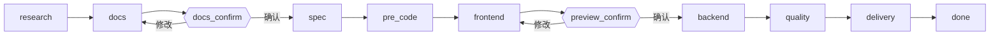

# spec-dev

`spec-dev` 是一个零依赖的 Codex / Claude Code 需求交付 Skill。它将自然语言需求转换为调研、三份核心文档、任务拆分、前端优先实现、后端开发、质量门禁和最终交付报告。

## 流水线



`evolve` 和 `patch` 模式先进入 `baseline`，确认现有项目边界、差量范围或缺陷范围，再进入同一条治理流程。

## 产物结构

```text
{项目根目录}/.spec-dev/
├── state.json
├── SESSION_BRIEF.md
├── PRE_CODE_CHECKLIST.md
└── changes/{requirement_name}/
    ├── proposal.md
    └── tasks.md

{项目根目录}/output/
├── {requirement_name}-research.md
├── {requirement_name}-prd.md
├── {requirement_name}-architecture.md
├── {requirement_name}-uiux.md
├── {requirement_name}-quality-report.md
└── {YYYY-MM-DD}-{requirement_name}-delivery.md
```

## 工作模式

| 模式 | 起点 | 适用场景 |
|------|------|----------|
| `new` | `research` | 全新功能或产品需求 |
| `evolve` | `baseline` | 既有项目的增量开发 |
| `patch` | `baseline` | Bug 修复和质量整改 |

## 安装

```bash
# Codex
git clone https://github.com/KkOma-value/spec-dev-skill.git ~/.codex/skills/spec-dev

# Claude Code
git clone https://github.com/KkOma-value/spec-dev-skill.git ~/.claude/skills/spec-dev
```

需要 Node.js 18+。无需 `npm install`。

## 使用

```text
/spec-dev 为订单服务新增按状态分页查询接口
/spec-dev 修复登录页跳转循环 --mode patch
/spec-dev 增加导出 CSV 功能 --mode evolve
```

也支持：`$spec-dev ...`、`spec-dev: ...`、`spec-dev：...`。

## CLI 参考

```bash
node scripts/spec-dev.mjs init --root <目录> --requirement "<需求描述>" [--mode new|evolve|patch]
node scripts/spec-dev.mjs next --root <目录>
node scripts/spec-dev.mjs advance --root <目录> --completed <阶段> [--artifact <类型=路径>]
node scripts/spec-dev.mjs gate --root <目录> --confirm <docs_confirm|preview_confirm>
node scripts/spec-dev.mjs deliver --root <目录>
node scripts/spec-dev.mjs archive --root <目录>   # deliver 的兼容别名
node scripts/spec-dev.mjs validate --root <目录>
```

Artifact 类型：`research`、`prd`、`architecture`、`uiux`、`proposal`、`tasks`、`quality`、`delivery`。

## 会话示例

```bash
node scripts/spec-dev.mjs init --root . --requirement "新增订单状态查询"
node scripts/spec-dev.mjs advance --root . --completed research --artifact research=output/xin-zeng-ding-dan-zhuang-tai-cha-xun-research.md
node scripts/spec-dev.mjs advance --root . --completed docs --artifact prd=output/xin-zeng-ding-dan-zhuang-tai-cha-xun-prd.md --artifact architecture=output/xin-zeng-ding-dan-zhuang-tai-cha-xun-architecture.md --artifact uiux=output/xin-zeng-ding-dan-zhuang-tai-cha-xun-uiux.md
node scripts/spec-dev.mjs gate --root . --confirm docs_confirm
node scripts/spec-dev.mjs advance --root . --completed spec --artifact proposal=.spec-dev/changes/xin-zeng-ding-dan-zhuang-tai-cha-xun/proposal.md --artifact tasks=.spec-dev/changes/xin-zeng-ding-dan-zhuang-tai-cha-xun/tasks.md
node scripts/spec-dev.mjs advance --root . --completed pre_code
node scripts/spec-dev.mjs advance --root . --completed frontend
node scripts/spec-dev.mjs gate --root . --confirm preview_confirm
node scripts/spec-dev.mjs advance --root . --completed backend
node scripts/spec-dev.mjs advance --root . --completed quality --artifact quality=output/xin-zeng-ding-dan-zhuang-tai-cha-xun-quality-report.md
node scripts/spec-dev.mjs deliver --root .
```

## 设计原则

| 原则 | 实现方式 |
|------|----------|
| 零依赖 | `scripts/spec-dev.mjs` 只使用 Node.js 内置模块 |
| 按需加载 | 每个阶段只返回当前需要读取的文件 |
| 状态持久化 | `.spec-dev/state.json` 支持跨会话恢复 |
| 硬门禁 | 文档、编码前、预览和质量门禁阻止跳步 |
| 前端优先 | 前端实现和预览确认后再进入后端 |
| 可追溯 | Research、PRD、Architecture、UI/UX、Tasks、Quality、Delivery 全链路关联 |

## 测试

```bash
node --test test/spec-dev.test.mjs
```

## 许可

[MIT](LICENSE)
