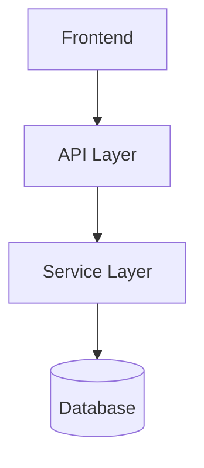
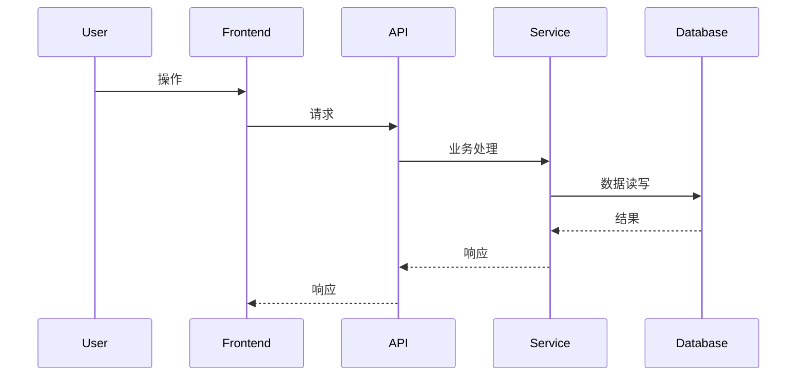

# Architecture 模板

# {需求名称} - Architecture

## 基本信息

| 字段 | 值 |
|------|-----|
| 需求名称 | {需求名称} |
| 创建日期 | {YYYY-MM-DD} |
| 所属项目 | {项目名称} |
| 技术栈 | {主框架及版本} |
| 状态 | 草稿/已确认 |
| Research 文档 | output/{requirement_name}-research.md |
| PRD 文档 | output/{requirement_name}-prd.md |

## 1. Research 继承

### 1.1 已确认事实

{继承 research 中的 Facts，标注来源}

### 1.2 分析结论

{继承 research 中的 Analysis，标注推理依据}

### 1.3 缺口与冲突

- [待确认] {未确认的信息}
- [冲突待确认] {冲突描述}

## 2. 系统边界与模块设计

### 2.1 影响范围

| 模块/服务 | 变更类型 | 说明 |
|-----------|---------|------|
| {模块名} | 新增/修改 | {说明} |

### 2.2 模块关系图



## 3. 关键技术决策

### 3.1 {决策名称}

**方案 A（推荐）：{方案名}**
- 优点: {优点}
- 缺点: {缺点}

**方案 B：{方案名}**
- 优点: {优点}
- 缺点: {缺点}

**决策**: 选择方案 A，因为 {选择理由}

## 4. API 契约

### 4.1 {接口名称}

- 路径: `{HTTP Method} {URL}`
- 鉴权: {认证/权限要求}
- 入参:

```json
{
  "field1": "类型 - 说明"
}
```

- 出参:

```json
{
  "code": "int - 状态码",
  "message": "string - 提示信息",
  "data": {}
}
```

| 错误码 | 说明 | 触发条件 |
|--------|------|---------|
| {code} | {说明} | {条件} |

## 5. 数据模型与迁移

```sql
-- {变更说明}
ALTER TABLE t_xxx ADD COLUMN status INT NOT NULL DEFAULT 0;
```

| 迁移动作 | 回滚动作 | 验证方式 |
|----------|----------|----------|
| {动作} | {动作} | {命令/检查项} |

## 6. 核心流程



## 7. 需求可追溯矩阵

| PRD 功能点 | 架构设计元素 | 预计实现文件 |
|-----------|--------------|-------------|
| {功能点} | {接口/模块/数据模型} | {路径} |

## 8. 风险与验证

| 风险 | 严重度 | 缓解措施 | 验证方式 |
|------|--------|----------|----------|
| {风险} | 高/中/低 | {措施} | {命令/检查} |

## 9. 待确认项

- [ ] {待确认项}
