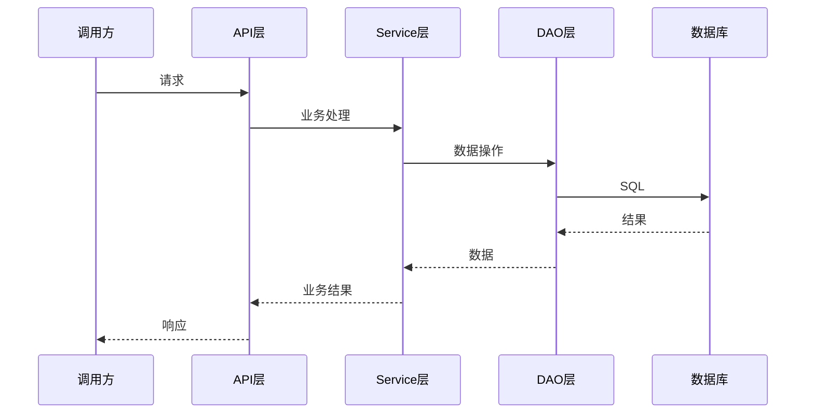

# 技术方案模板

# {需求名称} — 技术方案

## 基本信息

| 字段 | 值 |
|------|-----|
| 需求名称 | {需求名称} |
| 创建日期 | {YYYY-MM-DD} |
| 所属项目 | {项目名称} |
| 技术栈 | {主框架及版本} |
| 状态 | 草稿/已确认 |
| PRD 文档 | spec-dev/prd/{requirement_name}-prd.md |

## 1. 技术调研结论

### 1.1 技术栈现状

{当前项目使用的框架、中间件、数据库及版本}

### 1.2 相关技术方案参考

| 来源 | 核心要点 | 适用性 |
|------|---------|--------|
| {来源URL/文档} | {要点} | {高/中/低} |

### 1.3 可复用代码分析

| 类名.方法名 | 所在路径 | 用途 | 复用注意事项 |
|-------------|---------|------|-------------|
| {类名.方法名} | {文件路径} | {用途说明} | {需要修改的地方} |

## 2. 整体方案设计

### 2.1 方案概述

{用 1-2 段话描述整体技术方案}

### 2.2 核心交互时序图



### 2.3 需求可追溯矩阵

| PRD 功能点 | 设计元素 | 实现文件 |
|-----------|---------|---------|
| {功能点1} | {对应的设计模块} | {预计修改的文件} |
| {功能点2} | {对应的设计模块} | {预计修改的文件} |

## 3. 关键技术决策

### 3.1 {决策1名称}

**方案 A（推荐）：{方案名}**
- 优点: {优点}
- 缺点: {缺点}

**方案 B：{方案名}**
- 优点: {优点}
- 缺点: {缺点}

**决策**: 选择方案 A，因为 {选择理由}

### 3.2 {决策2名称}

{同上格式}

## 4. 数据库变更

### 4.1 表结构变更

```sql
-- {变更说明}
ALTER TABLE t_xxx ADD COLUMN status INT NOT NULL DEFAULT 0 COMMENT '状态';
```

### 4.2 数据迁移

{如果需要数据迁移，写明迁移 SQL 和执行策略}

## 5. 接口设计

### 5.1 {接口1名称}

- 路径: {HTTP Method} {URL}
- 入参:

```json
{
  "field1": "类型 — 说明",
  "field2": "类型 — 说明"
}
```

- 出参:

```json
{
  "code": "int — 状态码",
  "message": "string — 提示信息",
  "data": {}
}
```

- 异常码:

| 异常码 | 说明 | 触发条件 |
|--------|------|---------|
| {code} | {说明} | {条件} |

## 6. 详细设计

### 6.1 {功能点1} 实现方案

{具体到代码层面：写哪个类、加什么方法、改什么字段、核心逻辑}

### 6.2 {功能点2} 实现方案

{同上}

## 7. 成功指标

| 指标 | 当前值 | 目标值 | 测量方式 |
|------|--------|--------|---------|
| {指标名} | {当前} | {目标} | {如何测量} |

## 8. 风险与缓解措施

| 风险 | 严重度 | 可能性 | 缓解措施 |
|------|--------|--------|---------|
| {风险描述} | 高/中/低 | 高/中/低 | {具体措施} |

## 9. 待确认项

- [ ] {待确认的技术细节1}
- [ ] {待确认的技术细节2}
