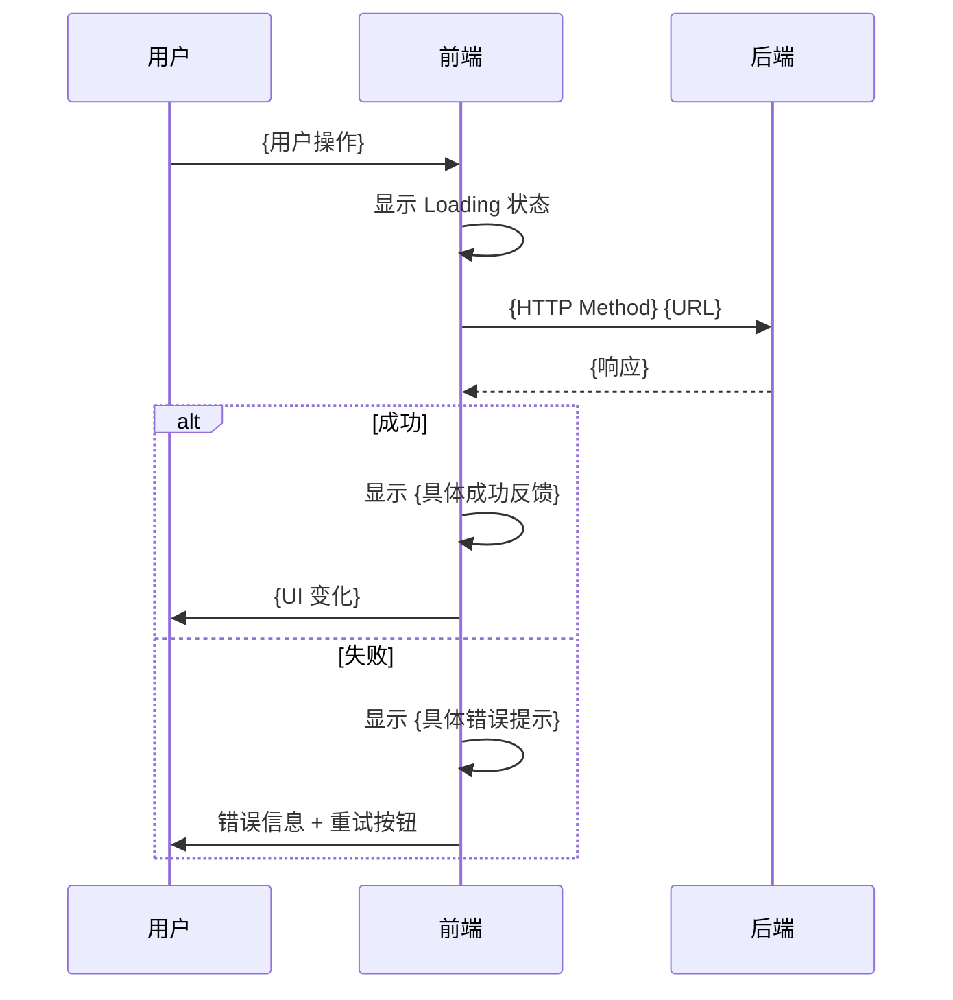

# UI/UX 设计规范模板

# {需求名称} — UI/UX 设计规范

## 基本信息

| 字段 | 值 |
|------|-----|
| 需求名称 | {需求名称} |
| 创建日期 | {YYYY-MM-DD} |
| PRD 文档 | spec-dev/prd/{requirement_name}-prd.md |
| 技术方案 | spec-dev/tech/{requirement_name}-tech.md |
| 前端技术栈 | {框架名称及版本} |
| 状态 | 草稿/已确认 |

---

## 1. 设计系统声明（Design System Declaration）

### 1.1 图标库

**选择**: {Lucide / Heroicons / Tabler Icons}

| 属性 | 值 |
|------|-----|
| 库名 | {lucide-react / @heroicons/react / @tabler/icons-react} |
| 版本 | {版本号} |
| 安装命令 | `{npm install ...}` |
| 选择理由 | {为什么选择这个图标库：Tailwind 生态/图标数量/风格偏好} |

> 规则：全文所有图标引用必须使用该库的具体图标名（如 `Search`、`ChevronRight`、`X`），禁止使用 emoji 作为任何功能图标、按钮图标、状态图标或导航图标。

### 1.2 组件库

| 属性 | 值 |
|------|-----|
| 库名 | {Ant Design / Element Plus / Radix UI / shadcn/ui / 原生 HTML / 其他} |
| 版本 | {版本号} |
| 选择理由 | {与现有技术栈兼容/社区活跃度/可定制性/包体积} |

> 如果项目已使用某组件库，优先沿用而非引入新库。此处必须明确声明决策和理由。

### 1.3 字体系列（Typography）

| 用途 | 字体栈 | 备选回退 |
|------|--------|---------|
| 标题字体 | `'{具体字体名}', ...` | `system-ui, -apple-system, sans-serif` |
| 正文字体 | `'{具体字体名}', ...` | `system-ui, -apple-system, sans-serif` |
| 等宽字体（代码） | `'{具体字体名}', ...` | `'Courier New', monospace` |

> 规则：不允许只写 `sans-serif` 或 `system-ui` 而不指定具体字体。标题和正文可以使用同一字体族，但必须分别声明。

### 1.4 排版层级（Type Scale）

| 层级 | 标签 | 字号 | 行高 | 字重 | 用途 |
|------|------|------|------|------|------|
| H1 | 页面标题 | {N}px | {N}px | 700 | 每个页面仅一个 |
| H2 | 区块标题 | {N}px | {N}px | 600 | 卡片标题、表格区块标题 |
| H3 | 子标题 | {N}px | {N}px | 600 | 列表项标题、表单分组标题 |
| H4 | 小标题 | {N}px | {N}px | 500 | 嵌套子区块标题 |
| Body | 正文 | 16px | 24px | 400 | 段落、表单标签、列表内容 |
| Caption | 辅助文本 | 14px | 20px | 400 | 说明文字、时间戳、辅助信息 |
| Small | 小字 | 12px | 16px | 400 | 标签、徽标、脚注 |

### 1.5 颜色令牌（Color Tokens）

#### 1.5.1 主色系（Primary）

| Token | Hex | 用途 |
|-------|-----|------|
| `primary-50` | `{hex}` | 最浅背景 |
| `primary-100` | `{hex}` | 浅背景、选中态背景 |
| `primary-500` | `{hex}` | 基准色 — 主按钮、链接、激活态 |
| `primary-700` | `{hex}` | hover 态 |
| `primary-900` | `{hex}` | active/pressed 态 |

#### 1.5.2 辅色系（Secondary / Accent）

| Token | Hex | 用途 |
|-------|-----|------|
| `secondary-50` | `{hex}` | 最浅背景 |
| `secondary-500` | `{hex}` | 基准色 — 次要按钮、标签 |
| `secondary-900` | `{hex}` | 深色强调 |

#### 1.5.3 语义色（Semantic）

| Token | Hex | 用途 |
|-------|-----|------|
| `success-100` | `{hex}` | 成功浅背景 |
| `success-500` | `{hex}` | 成功状态、成功按钮、成功图标 |
| `success-700` | `{hex}` | 成功深色文字 |
| `warning-100` | `{hex}` | 警告浅背景 |
| `warning-500` | `{hex}` | 警告状态、警告图标 |
| `warning-700` | `{hex}` | 警告深色文字 |
| `error-100` | `{hex}` | 错误浅背景 |
| `error-500` | `{hex}` | 错误/危险状态、错误图标、删除按钮 |
| `error-700` | `{hex}` | 错误深色文字 |
| `info-100` | `{hex}` | 信息浅背景 |
| `info-500` | `{hex}` | 信息提示、信息图标 |
| `info-700` | `{hex}` | 信息深色文字 |

#### 1.5.4 中性色（Neutral）

| Token | Hex | 用途 |
|-------|-----|------|
| `neutral-0` | `#FFFFFF` | 白色、页面背景、卡片背景 |
| `neutral-50` | `{hex}` | 最浅灰背景 |
| `neutral-100` | `{hex}` | 浅灰背景、表头背景 |
| `neutral-200` | `{hex}` | 边框色、分割线 |
| `neutral-300` | `{hex}` | 禁用态边框 |
| `neutral-400` | `{hex}` | 占位符文字 |
| `neutral-500` | `{hex}` | 次要文字、辅助图标 |
| `neutral-700` | `{hex}` | 正文色 |
| `neutral-800` | `{hex}` | 主要文字 |
| `neutral-900` | `{hex}` | 标题色、强调文字 |

> 规则：颜色总数量必须 >= 15 色。主色系 + 辅色系 + 语义色 + 中性色均须给出具体 hex 值，不允许只说「蓝色」「灰色」。

### 1.6 间距系统（Spacing Scale）

基于 4px 基准：

| Token | 值 | 用途 |
|-------|-----|------|
| `space-xs` | 4px | 紧凑内边距、图标与文字间距 |
| `space-sm` | 8px | 默认内边距、小间距、标签间距 |
| `space-md` | 12px | 中等内边距、选项间距 |
| `space-lg` | 16px | 卡片内边距、表单项间距 |
| `space-xl` | 24px | 区块间距、段落间距 |
| `space-2xl` | 32px | 大区块间距、页面分区 |
| `space-3xl` | 48px | 页面级上下间距 |
| `space-4xl` | 64px | 页面最大间距 |

### 1.7 圆角系统（Border Radius）

| Token | 值 | 用途 |
|-------|-----|------|
| `radius-sm` | 4px | 小按钮、标签、徽标、输入框 |
| `radius-md` | 8px | 卡片、下拉面板、弹窗 |
| `radius-lg` | 12px | 大卡片、模态框 |
| `radius-full` | 9999px | 胶囊按钮、头像、圆形图标容器 |

### 1.8 阴影系统（Shadow）

| Token | CSS 值 | 用途 |
|-------|--------|------|
| `shadow-sm` | `0 1px 2px 0 rgba(0,0,0,0.05)` | 卡片默认态、输入框 |
| `shadow-md` | `0 4px 6px -1px rgba(0,0,0,0.1), 0 2px 4px -2px rgba(0,0,0,0.1)` | 下拉面板、悬浮卡片 |
| `shadow-lg` | `0 10px 15px -3px rgba(0,0,0,0.1), 0 4px 6px -4px rgba(0,0,0,0.1)` | 模态框、抽屉 |

### 1.9 动效系统（Motion）

| Token | 值 | 用途 |
|-------|-----|------|
| `duration-fast` | 150ms | 微交互：hover 颜色变化、图标切换 |
| `duration-normal` | 250ms | 标准过渡：展开/收起、淡入淡出 |
| `duration-slow` | 350ms | 页面级动效：模态框进出、路由切换 |
| `easing-default` | `cubic-bezier(0.4, 0, 0.2, 1)` | 标准缓动（Material Design 标准） |
| `easing-decelerate` | `cubic-bezier(0.0, 0, 0.2, 1)` | 入场动效 |
| `easing-accelerate` | `cubic-bezier(0.4, 0, 1, 1)` | 退场动效 |

---

## 2. 页面/视图层级（Page/View Hierarchy）

### 2.1 导航结构

```mermaid
graph TD
    A[{应用名称} 首页] --> B[{页面1名称}]
    A --> C[{页面2名称}]
    B --> D[{子页面2-1}]
    B --> E[{子页面2-2}]
    C --> F[{页面3详情/参数:id}]
```

### 2.2 页面清单

| 序号 | 页面名称 | 路由路径 | 布局类型 | 权限要求 | 用途 |
|------|---------|---------|---------|---------|------|
| 1 | {页面名} | `/{path}` | 全屏/侧边栏+内容/顶部导航+内容 | {角色} | {该页面解决的用户任务} |
| 2 | {页面名} | `/{path}/:id` | 侧边栏+内容 | {角色} | {该页面解决的用户任务} |
| 3 | {页面名} | `/{path}/new` | 侧边栏+内容 | {角色} | {该页面解决的用户任务} |

> 需列出所有页面，不可遗漏。路由路径与后端接口路径应保持命名一致性。

### 2.3 页面间导航关系

| 来源页面 | 触发操作 | 目标页面 | 参数传递 |
|---------|---------|---------|---------|
| {列表页} | 点击列表项 | {详情页} | `id={item.id}` |
| {列表页} | 点击「新建」按钮 | {新建页} | 无 |
| {详情页} | 点击「返回」按钮 | {列表页} | 保留筛选条件 |
| {新建页} | 提交成功 | {列表页} | `toast=创建成功` |

---

## 3. 页面详细设计（Per-Page Design）

> 规则：每个页面必须描述 **5 种交互状态**（Loading / Empty / Error / Success / Edge Case），缺一不可。

### 3.1 {页面1名称} — `{路由路径}`

#### 3.1.1 页面目标

该页面的用户任务：{用户来到这个页面要完成什么任务？需要看到什么信息？需要执行什么操作？}

#### 3.1.2 布局草图

```
┌─────────────────────────────────────────┐
│  {顶部导航/面包屑}                       │
├─────────────────────────────────────────┤
│  {页面标题 H1}                           │
│  {操作栏：搜索框 + 筛选器 + 新建按钮}     │
├─────────────────────────────────────────┤
│  {主内容区域}                            │
│  {表格 / 卡片列表 / 表单 / 详情面板}      │
│                                         │
│                                         │
├─────────────────────────────────────────┤
│  {分页器 / 底部操作栏}                   │
└─────────────────────────────────────────┘
```

#### 3.1.3 交互状态

| 状态 | 表现形式 |
|------|---------|
| **Loading（加载中）** | {骨架屏：N 行灰色占位条 + 每个占位条宽度为 40%/60%/80% 随机；Spinner 位置：内容区居中；首次加载 vs 刷新加载是否有区别} |
| **Empty（空数据）** | {空状态插图位置：内容区居中；提示文案：「{具体文案}」；引导操作：{是否有「新建」引导按钮}} |
| **Error（错误）** | {错误提示位置：{Toast / 内联 / 页面级}；重试按钮位置：{错误信息下方}；错误信息内容：「{具体文案}」；超时/网络/服务端错误是否区分展示} |
| **Success（成功）** | {成功反馈形式：{Toast 右上角 / 页面跳转 / 内联提示}；成功文案：「{具体文案}」；自动消失时间：{N}ms} |
| **Edge Case（边界情况）** | {超长文本截断方案：省略号 + Tooltip / 换行；数据量过大：分页大小 {N} / 虚拟滚动；权限不足：降级展示「无权限」占位；并发冲突：乐观锁冲突提示} |

#### 3.1.4 核心交互

| 序号 | 用户操作 | 系统行为 | 对应 API |
|------|---------|---------|---------|
| 1 | 点击「{按钮名}」 | {系统响应描述} | {接口名} |
| 2 | 输入「{搜索关键词}」并回车 | {系统响应描述} | {接口名} |
| 3 | 点击列表项 | 跳转到详情页 `/{path}/{id}` | — |

#### 3.1.5 响应式布局

| 断点 | 宽度范围 | 布局变化 |
|------|---------|---------|
| **Desktop** | >= 1025px | {完整布局：侧边栏可见 + 表格全列 + 操作栏完整} |
| **Tablet** | 768px — 1024px | {侧边栏收起 + 表格隐藏次要列 + 操作栏折叠为下拉} |
| **Mobile** | <= 767px | {侧边栏隐藏 + 表格转为卡片列表 + 操作栏固定在底部} |

### 3.2 {页面2名称} — `{路由路径}`

{按 3.1 结构重复，覆盖所有页面}

---

## 4. 组件清单（Component Inventory）

### 4.1 全局组件

| 组件名 | 用途 | 使用范围 | 类型 |
|--------|------|---------|------|
| `{ComponentName}` | {功能描述} | 全局 | 布局/导航/反馈/数据展示 |
| `{ComponentName}` | {功能描述} | 全局 | 布局/导航/反馈/数据展示 |

### 4.2 页面级组件

| 组件名 | 所属页面 | 用途 |
|--------|---------|------|
| `{ComponentName}` | {页面名} | {功能描述} |

### 4.3 组件状态定义

> 规则：每个组件必须列出所有适用状态。必填状态：**default**。条件状态：hover / active / disabled / loading / error / empty / focused。

#### 4.3.1 `{ComponentName}`

| 属性 | 说明 |
|------|------|
| **用途** | {一句话描述} |
| **Props** | `propName: Type` — {说明} |

| 状态 | 视觉表现 | 触发条件 | 行为 |
|------|---------|---------|------|
| default | {默认样式描述} | 初始渲染 | {行为} |
| hover | {hover 样式：背景色变/边框高亮/光标形状} | 鼠标移入 | {行为} |
| active | {active 样式} | 鼠标按下 | {行为} |
| disabled | {disabled 样式：灰色背景/降低透明度} | `disabled=true` | 不响应点击 |
| loading | {loading 样式：Spinner 替换图标/背景骨架} | 异步操作中 | 不响应点击 |
| error | {error 样式：红色边框/错误图标} | 校验失败 | 显示错误提示 |
| empty | {空状态样式} | 无数据 | 显示空状态占位 |

#### 4.3.2 `{ComponentName}`

{按 4.3.1 格式重复，覆盖所有组件}

---

## 5. 用户流程图（User Flow Diagram）

### 5.1 核心用户流程

```mermaid
flowchart TD
    A[用户进入{首页}] --> B{{判断是否已登录}}
    B -->|未登录| C[跳转登录页]
    B -->|已登录| D[查看{列表页}]
    D --> E{是否有数据}
    E -->|空| F[显示空状态引导]
    E -->|有数据| G[展示数据列表]
    G --> H[用户{操作1}]
    H --> I[调用 API {接口名}]
    I --> J{{操作结果}}
    J -->|成功| K[显示成功反馈]
    J -->|失败| L[显示错误提示]
    K --> M[刷新列表/跳转]
    L --> N{用户选择}
    N -->|重试| I
    N -->|取消| G
```

### 5.2 {功能点1}子流程



### 5.3 异常流程

| 异常场景 | 触发条件 | 用户感知 | 恢复路径 |
|---------|---------|---------|---------|
| 网络超时 | 请求超过 {N}ms | {Toast/内联 错误提示 + 重试按钮} | 用户点击重试 |
| Token 过期 | 接口返回 401 | {跳转登录页 + Toast 提示} | 重新登录后回到当前页 |
| 权限不足 | 接口返回 403 | {降级展示 + 提示文案} | 联系管理员 |
| 并发冲突 | 数据版本不一致 | {Toast 提示 + 刷新数据} | 用户手动刷新重试 |

---

## 6. API 契约对齐（API Contract Alignment）

> 规则：此表中每一行的交互操作必须能从 Tech 文档中找到对应的接口定义。如果 Tech 文档中缺少某接口，须标注 `[API 缺口 — 需 Tech 补充]`。不允许凭空编造 Tech 文档中不存在的接口。

### 6.1 接口对齐总表

| 页面 | 用户交互 | HTTP 方法 | API 路径 | 请求体/参数 | 预期响应 | Tech 文档对应章节 |
|------|---------|----------|---------|------------|---------|-----------------|
| {页面} | 点击「搜索」 | `GET` | `/api/{resource}` | `?keyword={s}&page={n}&size={n}` | `{ code, data: { list: T[], total: n } }` | {章节号} |
| {页面} | 点击「新建」提交 | `POST` | `/api/{resource}` | `{ field1: T, field2: T }` | `{ code, data: T }` | {章节号} |
| {页面} | 点击列表项 | `GET` | `/api/{resource}/{id}` | — | `{ code, data: T }` | {章节号} |
| {页面} | 点击「编辑」并保存 | `PUT` | `/api/{resource}/{id}` | `{ field1: T, field2: T }` | `{ code, data: T }` | {章节号} |
| {页面} | 点击「删除」 | `DELETE` | `/api/{resource}/{id}` | — | `{ code, message: s }` | {章节号} |

### 6.2 接口缺口标注

| 页面交互 | 缺口描述 | 建议补充的接口 | 状态 |
|---------|---------|--------------|------|
| {交互} | {所需但 Tech 未定义的接口} | `{Method} {Path}` | `[API 缺口 — 需 Tech 补充]` |

### 6.3 前后端数据类型映射

| 前端字段 | 前端类型 | 后端字段 | 后端类型 | 转换逻辑 |
|---------|---------|---------|---------|---------|
| `{frontendField}` | `string` | `{backendField}` | `Integer` | `parseInt()` / `后端返回码值 → 前端展示文案` |
| `{frontendField}` | `Date` | `{backendField}` | `Long (timestamp)` | `new Date(timestamp)` / `format: 'YYYY-MM-DD HH:mm'` |
| `{frontendField}` | `enum` | `{backendField}` | `Integer` | 枚举映射: `{ 0: '待处理', 1: '进行中', 2: '已完成' }` |

---

## 7. 响应式设计（Responsive Design）

### 7.1 断点定义

| 断点名称 | 宽度范围 | 目标设备 |
|---------|---------|---------|
| **Mobile** | <= 767px | 手机竖屏 |
| **Tablet** | 768px — 1024px | 平板、手机横屏 |
| **Desktop** | >= 1025px | 桌面显示器 |

### 7.2 布局变化汇总

| 页面 | Mobile (<= 767px) | Tablet (768 — 1024px) | Desktop (>= 1025px) |
|------|-------------------|----------------------|---------------------|
| {页面1} | {布局变化描述} | {布局变化描述} | 完整布局 |
| {页面2} | {布局变化描述} | {布局变化描述} | 完整布局 |

### 7.3 通用响应式规则

| 规则 | 说明 |
|------|------|
| 侧边导航 | Mobile/Tablet: 默认收起，通过汉堡菜单触发；Desktop: 始终展开 |
| 表格 | Mobile: 转为卡片列表；Tablet: 隐藏非关键列（>= 4 列则隐藏最后 2 列）；Desktop: 展示全部列 |
| 操作栏 | Mobile: 搜索框全宽 + 操作按钮固定在底部；Tablet: 搜索框收缩 + 操作按钮在右侧；Desktop: 完整展开 |
| 弹窗/抽屉 | Mobile: 全屏展示；Tablet/Desktop: 居中弹窗 (max-width: {N}px) 或右侧抽屉 (width: {N}px) |
| 字体缩放 | Mobile: 根字号不做缩放；内容区域 padding 从 16px 缩减到 12px |
| 触摸目标 | Mobile/Tablet: 所有可点击元素最小触摸区域 44x44px；Desktop: 无此限制 |

---

## 8. 可访问性检查清单（Accessibility Checklist）

### 8.1 视觉可访问性

- [ ] 所有文本与背景的对比度至少达到 **WCAG AA 级**（正文 4.5:1，大字 3:1）
  - 使用 `neutral-800` 正文色 + `neutral-0` 白色背景 → 对比度 >= {N}:1
  - 使用 `primary-500` 链接色 + `neutral-0` 白色背景 → 对比度 >= {N}:1
- [ ] 不使用颜色作为唯一的信息传达方式（错误状态同时使用图标 + 颜色 + 文字）
- [ ] 表单必填字段除了红色星号 `*` 外，有额外的标识（如文字标注「必填」）
- [ ] 聚焦态（`:focus-visible`）有可见的聚焦环：`outline: 2px solid {primary-500}; outline-offset: 2px`
- [ ] 文字可在不破坏布局的情况下放大至 200%

### 8.2 键盘可访问性

- [ ] 所有交互元素（按钮、链接、输入框、下拉菜单）可通过 `Tab` 键到达
- [ ] 下拉菜单项可通过方向键导航，`Enter` 键选择，`Escape` 键关闭
- [ ] 模态框打开时焦点自动移入；关闭后焦点回到触发元素
- [ ] `Tab` 键顺序符合视觉布局顺序（从左到右，从上到下）
- [ ] 自定义组件（如自定义 Select、DatePicker）有正确的键盘交互支持

### 8.3 屏幕阅读器可访问性

- [ ] 所有图标（如 Search、X、ChevronRight）有 `aria-label` 或 `<title>` 标注
- [ ] 装饰性图标/图片设置 `aria-hidden="true"`
- [ ] 表单输入框有关联的 `<label>` 或 `aria-labelledby`
- [ ] 错误提示通过 `aria-describedby` 关联到对应输入框
- [ ] 页面有且仅有一个 `<h1>`
- [ ] 标题层级（h1 → h2 → h3 → h4）不跳级
- [ ] Loading 状态有 `aria-live="polite"` 或 `aria-busy="true"` 通知
- [ ] Toast 通知使用 `role="alert"` 或 `aria-live="assertive"`

### 8.4 可访问性测试工具

| 工具 | 用途 | 达标标准 |
|------|------|---------|
| axe DevTools / axe-core | 自动化可访问性扫描 | 0 个 Critical / Serious 问题 |
| Lighthouse Accessibility | 页面级可访问性评分 | 得分 >= 90 |
| 手动键盘测试 | 键盘可访问性验证 | 所有交互可通过键盘完成 |
| 屏幕阅读器测试 | VoiceOver (macOS) / NVDA (Windows) | 所有内容可被正确朗读 |

---

## 9. 表单设计规范（Form Design Standards）

> 本小节对全局表单组件的设计标准进行约束，确保各页面表单一致。

### 9.1 表单布局规则

| 规则 | 标准 |
|------|------|
| 标签位置 | {顶部对齐 / 左侧对齐}（选择并全局统一） |
| 标签与输入框间距 | {N}px |
| 表单项垂直间距 | {N}px |
| 必填标识 | 红色星号 `*` + 标签后文字 `(必填)`，颜色使用 `error-500` |
| 校验触发时机 | onBlur + onSubmit，不在 onChange 时立即显示错误（避免干扰输入） |
| 错误提示位置 | 输入框下方，距输入框 {N}px，颜色 `error-500`，字号 Caption |
| 提交按钮对齐 | {右对齐 / 居中} |

### 9.2 表单输入组件状态

| 组件 | 校验规则 | 错误提示文案 | 备注 |
|------|---------|-------------|------|
| `{InputName}` — {用途} | `{rule: required, maxLength: N, pattern: /regex/}` | 「{具体错误文案}」 | {备注} |
| `{SelectName}` — {用途} | `{rule: required}` | 「{具体错误文案}」 | {备注} |

### 9.3 提交按钮三态

| 状态 | 视觉 | 触发条件 |
|------|------|---------|
| **默认** | 主色背景 + 白色文字 `{primary-500}` | 表单已加载，未提交 |
| **加载中** | 按钮文字变为 Spinner（{具体图标名}动画旋转）+ 文字「提交中...」 | 点击提交后，等待接口响应 |
| **禁用** | 灰色背景 `neutral-200` + 灰色文字 `neutral-400` + `cursor: not-allowed` | 表单必填项未填或校验未通过 |

### 9.4 列表/表格设计规则

| 规则 | 标准 |
|------|------|
| 默认排序 | {按创建时间倒序 / 按更新时间倒序 / 按 {字段} 正序} |
| 分页大小 | 默认 {N} 条/页，可选 {N}/{N}/{N} |
| 分页位置 | {表格下方居中 / 表格下方右对齐} |
| 空数据展示 | 居中显示空状态插图（图标: {具体图标名}）+ 文案：「{具体文案}」 |
| 搜索交互 | 输入后 {300ms} debounce 自动搜索 / Enter 键手动搜索 |
| 筛选交互 | {即时筛选（onChange）/ 点击「查询」按钮筛选} |
| 表格加载 | 骨架屏：N 行灰色占位行，与表格列宽一致 |
| 操作列 | 固定在最右列，超过 {N} 个操作时折叠为「更多」{具体图标名} 下拉菜单 |

---

## 10. 反模式清单（Anti-Patterns to Avoid）

以下为绝对禁止的设计模式，UI/UX 文档全文中出现任一项即视为不合格：

| 序号 | 禁止模式 | 说明 | 应使用替代方案 |
|------|---------|------|-------------|
| 1 | **紫色/紫蓝渐变作为主色调** | AI 生成内容的典型模板化特征 | 使用已定义的主色系 `primary-*` |
| 2 | **粉色渐变作为主色调** | AI 生成内容的典型模板化特征 | 使用已定义的主色系 `primary-*` |
| 3 | **emoji 作为 UI 图标** | 🚀⭐💡✨ 等 emoji 不可用于功能图标、按钮图标、状态图标 | 使用已声明的图标库具体图标名 |
| 4 | **仅声明 `sans-serif` / `system-ui`** | 字体未具体指定，导致不同平台展示不一致 | 必须声明具体字体名 + 完整字体栈 |
| 5 | **只有 Desktop 布局** | 缺少 Tablet/Mobile 响应式设计 | 每个页面必须覆盖三个断点 |
| 6 | **只有 Happy Path** | 缺少 Loading / Empty / Error / Edge Case 状态 | 每个页面必须描述 5 种交互状态 |
| 7 | **「无信息层的卡片墙」** | 页面只有卡片网格排列，无标题、无操作入口、无状态区分 | 每张卡片必须有：标题 + 摘要信息 + 操作入口 + 状态标识 |
| 8 | **颜色无 hex 值** | 只说「蓝色」「灰色」，无具体色值 | 所有颜色必须标注 hex 值 |
| 9 | **间距无 px 值** | 「适量留白」「适当间距」等无法验证的表述 | 所有间距必须标注具体 px 值 |
| 10 | **图标模糊引用** | 「一个搜索图标」「一个关闭按钮」 | 使用图标库具体名称如 `Search`、`X` |
| 11 | **模糊量词** | 「适量」「适当」「大概」「稍微」「比较」 | 全部使用具体数值 |
| 12 | **模糊建议** | 「建议使用 X」「可以考虑 Y」 | 使用「选择 X，因为 Y」的明确句式 |
| 13 | **Hero 区域放巨大渐变文字配 emoji** | AI 模板化 Landing Page 特征 | 不使用 Hero 区域，或使用具体的业务价值主张文案 |
| 14 | **全页面居中布局无理由** | 无内容策略支撑的纯居中布局 | 根据内容策略选择布局：列表用左对齐、表单用居中或左对齐并给出理由 |
| 15 | **接口凭空编造** | Tech 文档中不存在的 API | 所有接口必须能追溯到 Tech 文档，缺口标注 `[API 缺口 — 需 Tech 补充]` |
| 16 | **组件库未声明** | 未说明前端使用什么组件库实现 | 必须在 1.2 节声明组件库 |

---

## 11. 自检清单（Pre-Submission Checklist）

提交本文档前，必须逐条确认以下项目全部通过。任一条不通过即视为文档不合格：

### 图标与视觉
- [ ] 图标库已三选一并写明了库名、版本、安装命令？
- [ ] 全文所有图标引用使用了该库的具体图标名（如 `Search`、`X`）？
- [ ] 全文无任何 emoji 字符出现在 UI 元素描述中？
- [ ] 主色调不是紫色、紫蓝渐变或粉色渐变？

### 设计 Token
- [ ] 颜色调色板 >= 15 色，且每个颜色都有 hex 值？
- [ ] 主色系（primary-50/100/500/700/900）已定义？
- [ ] 语义色（success / warning / error / info 各至少 2 色）已定义？
- [ ] 中性色 >= 8 色已定义？
- [ ] 排版层级 >= 4 级（H1 / H2 / H3 / H4 / Body / Caption / Small），且每级都有字号/行高/字重？
- [ ] 间距系统基于 4px 基准，至少定义了 8 个层级（xs / sm / md / lg / xl / 2xl / 3xl / 4xl）？
- [ ] 圆角至少定义了 4 个层级（sm / md / lg / full）？
- [ ] 阴影至少定义了 3 个层级（sm / md / lg）且有具体 CSS 值？
- [ ] 字体系列指定了具体字体名（不是仅 `sans-serif`）？

### 组件与页面
- [ ] 组件库已声明（库名 + 版本 + 选择理由）？
- [ ] 页面清单完整，包含所有页面的路由路径？
- [ ] 导航结构使用了 Mermaid 流程图？
- [ ] 每个页面描述了 5 种交互状态（loading / empty / error / success / edge-case）？
- [ ] 每个页面描述了在 3 个断点（mobile / tablet / desktop）下的布局变化？

### API 对齐
- [ ] API 契约对齐表完整，每个页面交互都能追溯到 Tech 文档的具体接口？
- [ ] 无 Tech 文档中不存在的接口被引用？
- [ ] 接口缺口已标注 `[API 缺口 — 需 Tech 补充]`？

### 表单与数据展示
- [ ] 所有表单标注了必填/选填、校验规则、错误提示文案？
- [ ] 所有列表/表格标注了排序规则、分页大小、空数据展示？
- [ ] 表单提交按钮标注了三种状态（默认/加载中/禁用）？

### 可访问性
- [ ] 可访问性检查清单已逐项审核？
- [ ] 颜色对比度满足 WCAG AA 级标准？
- [ ] 所有交互可通过键盘完成？
- [ ] 所有图标有 `aria-label`？

### 文档质量
- [ ] 所有颜色都有 hex 值？
- [ ] 所有间距都有 px 值？
- [ ] 无「适量」「适当」「大概」「建议」「可以考虑」等模糊表述？
- [ ] 所有 `[待确认]` 项都来自 PRD/Tech 文档的继承，非自行假设？

---

## 模板填写说明

1. **所有 `{placeholder}` 必须替换为实际值**，不允许保留任何占位符在最终文档中。
2. **设计决策使用「选择 X，因为 Y」句式**，不用「建议使用 X」。
3. **交互描述使用「当用户...时，系统应...」格式**。
4. **视觉规范全部使用具体数值**（px、hex、ms），不允许模糊量词。
5. **不确定的地方标注 `[待确认]`**，绝不凭空设计。
6. **产出路径**: `spec-dev/uiux/{requirement_name}-uiux.md`
